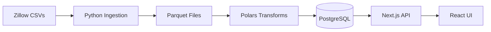

<div align="center">

# HousingIQ

**Real-time housing market analytics platform powered by Zillow data**

A full-stack application combining a modern data engineering pipeline with an interactive analytics dashboard, covering 450+ U.S. regions with home value trends, rent indices, and AI-powered market insights.

[](https://nextjs.org/)
[](https://dagster.io/)
[](https://www.typescriptlang.org/)
[](https://www.python.org/)
[](https://www.postgresql.org/)
[](https://www.docker.com/)

</div>

---

## Features

**Interactive Dashboard** — Market overview with key statistics across 51 states, 98 metros, 101 counties, and 200 cities. Filterable by home type (Single Family, Condo, Multi Family), price tier, and time range. Includes market health scores, top movers, and rent yield analysis.

**Rankings** — Sortable leaderboard of top markets by home value appreciation, rent growth, rent yield, price-to-rent ratio, and absolute home value. Markets are classified as Hot (>10% YoY), Warm (3–10%), or Cold (<3%).

**Region Comparison** — Compare up to 4 regions side-by-side with interactive trend charts, color-coded stats, and mixed geography levels (state vs. metro vs. city).

**Investment Calculator** — ROI calculator with adjustable parameters for purchase price, down payment, interest rate, loan term, rent, appreciation, and expenses. Projects equity growth and cash flow over time.

**Interactive Map** — Choropleth map of the U.S. with heatmap coloring by home value or YoY change. Hover tooltips and a companion data table.

**AI Chat** — Conversational interface for querying housing market data using natural language. Built with the AI SDK, supports tool calls for fetching live market trends, and displays structured data responses.

## Architecture

```mermaid
graph TD
    subgraph Data Platform — Python
        A[Zillow Research<br/>CSV Downloads] --> B[Dagster<br/>Orchestration]
        B --> C[Polars<br/>Transforms]
        C --> D[Great Expectations<br/>Validation]
    end

    subgraph Database
        D --> E[(PostgreSQL 16<br/>regions · zhvi_values · zori_values<br/>market_summary · inventory · affordability)]
    end

    subgraph Webapp — Next.js 16 / React 19
        E --> F[Server Components<br/>Drizzle ORM]
        E --> G[API Routes<br/>AI SDK · Chat]
        F --> H[Client Components<br/>Recharts · D3 · Maps]
        G --> H
        I[NextAuth.js v5<br/>Google OAuth] --> F
    end
```

### Data Flow



Dagster orchestrates the pipeline in three asset groups:
1. **Ingestion** — Downloads Zillow CSV data and converts to Parquet
2. **Transforms** — Polars computes YoY/MoM changes, market summaries, heat indices, and affordability metrics
3. **App Database** — Loads final tables into PostgreSQL for the webapp to query

## Tech Stack

| Layer | Technology | Purpose |
|-------|-----------|---------|
| **Frontend** | Next.js 16, React 19, TypeScript 5 | App Router with Server & Client Components |
| **Styling** | Tailwind CSS 4, shadcn/ui, Motion | Responsive UI with animations |
| **Visualization** | Recharts, D3, React Simple Maps | Charts, geospatial map, data tables |
| **AI** | AI SDK, Claude | Conversational market insights |
| **ORM** | Drizzle ORM | Type-safe database queries |
| **Auth** | NextAuth.js v5 | Google OAuth + email/password |
| **Orchestration** | Dagster | Software-defined assets with lineage tracking |
| **Transforms** | Polars | High-performance DataFrame operations |
| **Data Quality** | Great Expectations | Validation before loading |
| **Database** | PostgreSQL 16 | Application and pipeline storage |
| **Infrastructure** | Docker Compose | Multi-service local and production orchestration |
| **Deployment** | Vercel + Neon | Webapp hosting + managed PostgreSQL |

## Project Structure

```
housingiq-app/
├── webapp/                        # Next.js full-stack web application
│   ├── src/
│   │   ├── app/                   # App Router (dashboard, chat, login, docs)
│   │   ├── components/            # UI components (charts, map, calculator)
│   │   └── lib/                   # DB schema, auth config, utilities
│   └── Dockerfile
│
├── data-platform/                 # Python data engineering
│   ├── housingiq_dagster/         # Dagster assets & definitions
│   ├── ingestion/                 # Zillow data source connectors
│   ├── great_expectations/        # Data quality validation suites
│   ├── tests/                     # pytest test suite
│   └── Dockerfile
│
├── video/                         # Remotion promo video (React)
├── docker-compose.yml             # Full-stack service definitions
└── Makefile                       # Project orchestration commands
```

## Getting Started

### Docker (recommended for demo)

Only Docker is required — no local Python or Node.js installation needed.

```bash
# Build, start, and initialize everything
make docker-build && make docker-up && make docker-init
```

Then open:
- **Webapp** → http://localhost:3000 (login: `test@housingiq.com` / `TestPassword123!`)
- **Dagster UI** → http://localhost:3001 (materialize assets to load data)
- **pgweb** → http://localhost:8081 (browse the database)

### Local Development

For active development with hot-reload:

```bash
# Prerequisites: Python 3.11+, Node.js 20+

# First-time setup (installs deps, starts DB, pushes schema, seeds user)
make setup

# Start all services with hot-reload
make dev
```

| | Local Dev (`make dev`) | Docker (`make docker-up`) |
|---|---|---|
| PostgreSQL | Docker container | Docker container |
| Webapp | Local process (hot-reload) | Docker container |
| Dagster | Local process (hot-reload) | Docker container |
| Best for | Active development | Demo / deployment |

### Loading Data

Open the Dagster UI at http://localhost:3001 and materialize assets in order:

1. **ingestion** — downloads Zillow CSV data
2. **transforms** — computes analytics with Polars
3. **app_database** — loads tables into PostgreSQL

## Commands Reference

<details>
<summary><strong>Docker</strong></summary>

```bash
make docker-build      # Build all Docker images
make docker-up         # Start all services
make docker-init       # Initialize DB schema + seed test user
make docker-down       # Stop all services
make docker-logs       # Follow logs from all services
make docker-restart    # Rebuild and restart
make docker-clean      # Stop and remove all volumes (fresh start)
```

</details>

<details>
<summary><strong>Local Development</strong></summary>

```bash
make setup             # First-time setup
make dev               # Start all services (webapp + Dagster + DB)
make up                # Start PostgreSQL + pgweb only
make down              # Stop services
make webapp            # Start Next.js only
make dagster           # Start Dagster only
make psql              # Connect to PostgreSQL CLI
make db-push           # Push Drizzle schema to database
make db-seed           # Seed test user
make materialize       # Materialize all Dagster assets
```

</details>

<details>
<summary><strong>Data Platform</strong></summary>

```bash
# From data-platform/
make setup             # Install Python dependencies
make dagster           # Start Dagster UI
make test              # Run pytest
make lint              # Run ruff linter
make typecheck         # Run mypy
make gx                # Run Great Expectations checkpoint
```

</details>

## Production Deployment

```mermaid
graph LR
    subgraph Local / CI — Docker Compose
        A[Dagster] --> B[Polars] --> C[(PostgreSQL)]
    end

    subgraph Cloud
        D[(Neon — Managed PG)]
        E[Vercel — Webapp]
        E --> D
    end

    C -- sync --> D
```

```bash
# Run data pipeline
make docker-build && make docker-up && make docker-init

# Sync to production database
NEON_DATABASE_URL='postgresql://...' make sync-to-neon
```

The webapp deploys to Vercel automatically via GitHub Actions.

## Data Source

All housing data is sourced from [Zillow Research](https://www.zillow.com/research/data/), updated monthly:

- **ZHVI** — Zillow Home Value Index (home values by region and property type)
- **ZORI** — Zillow Observed Rent Index (rental prices by region)

## License

MIT
