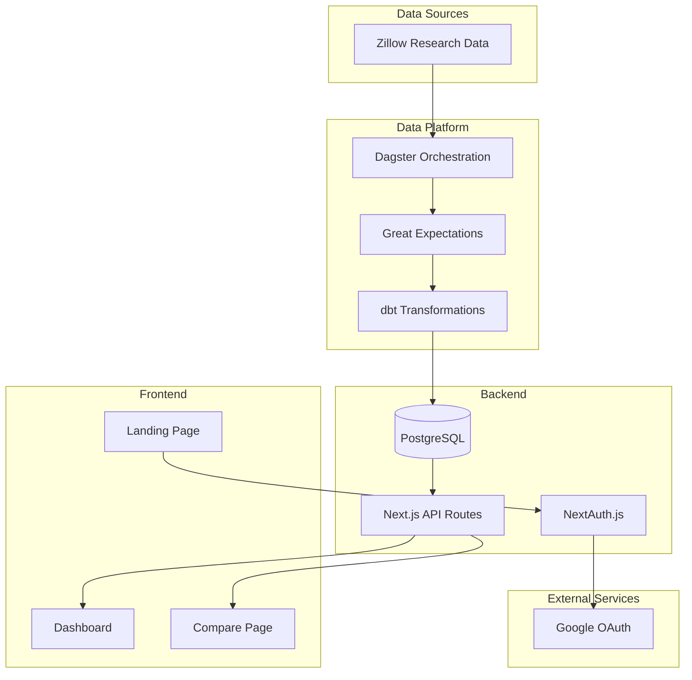

# HousingIQ - Project Overview

## Introduction

HousingIQ is a housing analytics web application that provides insights into US housing market trends using Zillow data. The application features interactive visualizations, geographic comparisons, and historical trend analysis.

## Project Goals

1. **Visualize Housing Data**: Display Zillow Home Value Index (ZHVI) trends over time
2. **Geographic Analysis**: Compare housing values across states, metros, cities, and zip codes
3. **User Authentication**: Secure access via Google OAuth
4. **Modern Data Platform**: Automated ETL using Dagster, dbt, and Great Expectations

## High-Level Architecture



## Technology Stack

| Layer | Technology | Version |
|-------|------------|---------|
| Framework | Next.js | 15.x |
| Language | TypeScript | 5.x |
| Styling | Tailwind CSS | 4.x |
| UI Components | shadcn/ui + Radix UI | - |
| Database | PostgreSQL | 16 |
| ORM | Drizzle ORM | 0.45.x |
| Authentication | NextAuth.js | 5.0 (beta) |
| Charts | Recharts | 3.x |
| Orchestration | Dagster | 1.6.x |
| Transformations | dbt | 1.7.x |
| Data Quality | Great Expectations | 0.18.x |
| Data Processing | Polars (Python) | 0.20.x |

## Project Structure

```
housingiq-app/                     # Monorepo root
├── webapp/                        # Next.js application
│   ├── src/
│   │   ├── app/                  # App Router pages
│   │   │   ├── page.tsx          # Landing page
│   │   │   ├── login/            # Login page
│   │   │   ├── dashboard/        # Protected dashboard
│   │   │   └── api/              # API routes
│   │   ├── components/           # React components
│   │   │   └── ui/               # UI components
│   │   └── lib/                  # Utilities
│   │       ├── db/               # Database schema & queries
│   │       └── auth/             # Authentication config
│   └── .env.local                # Environment variables
│
├── data-platform/                 # Data engineering stack
│   ├── ingestion/                # Python data extraction
│   ├── dagster/                  # Orchestration
│   ├── dbt/                      # SQL transformations
│   ├── great_expectations/       # Data quality
│   └── tests/                    # Python tests
│
├── docker-compose.yml            # Shared PostgreSQL
├── Makefile                      # Orchestration commands
└── docs/                         # Documentation
```

## Key Features

### Implemented

- [x] Next.js 15 application with App Router
- [x] Google OAuth authentication
- [x] Landing page with feature preview
- [x] Dashboard with ZHVI charts
- [x] State comparison functionality
- [x] Drizzle ORM database schema
- [x] Docker Compose for local PostgreSQL
- [x] Dagster + dbt data platform
- [x] Zillow data ingestion pipeline
- [x] Great Expectations validation

### Planned

- [ ] Real data integration (connect dashboard to database)
- [ ] Metro/City/Zip level drill-down
- [ ] Rental price (ZORI) visualization
- [ ] Market forecasts display
- [ ] Export functionality
- [ ] User preferences storage

## Data Source

Data is sourced from [Zillow Research](https://www.zillow.com/research/data/):

- **ZHVI**: Zillow Home Value Index (122M+ records)
- **ZORI**: Zillow Observed Rent Index
- **Inventory**: For-sale listings data
- **Forecasts**: Home value predictions

Geographic coverage:
- 50 States
- 3,000+ Counties
- 900+ Metro areas
- 30,000+ Cities
- 27,000+ Neighborhoods
- 15,000+ Zip codes
