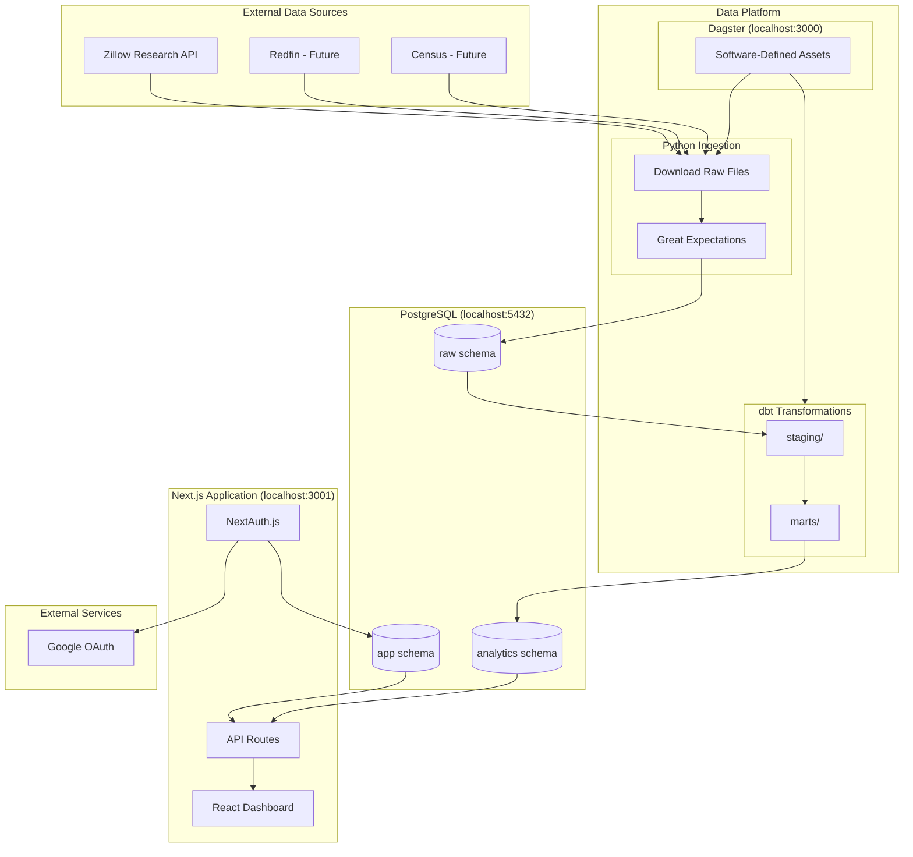
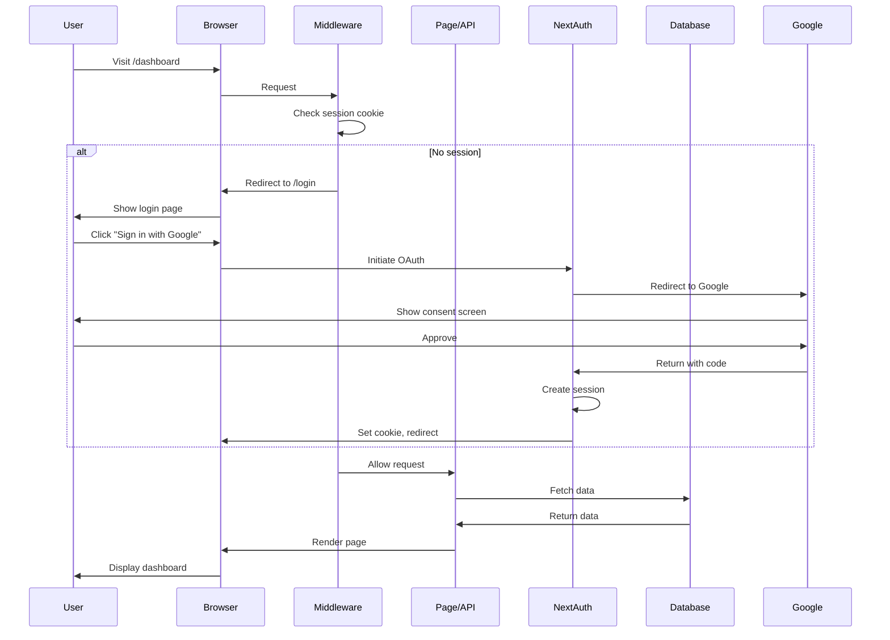
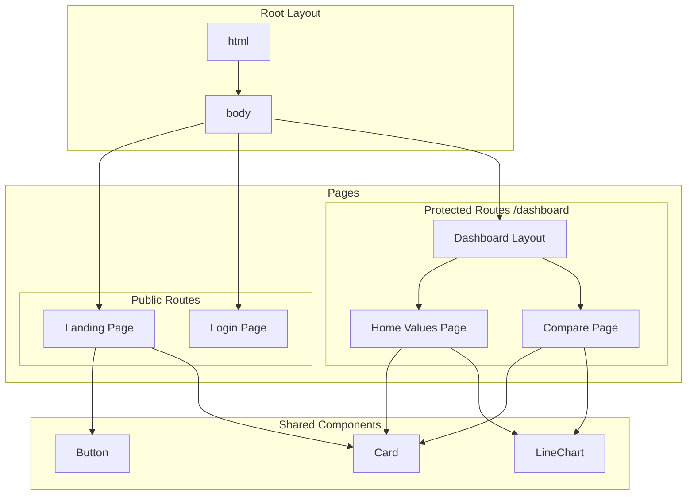
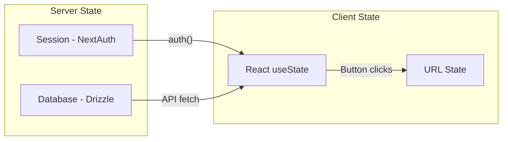
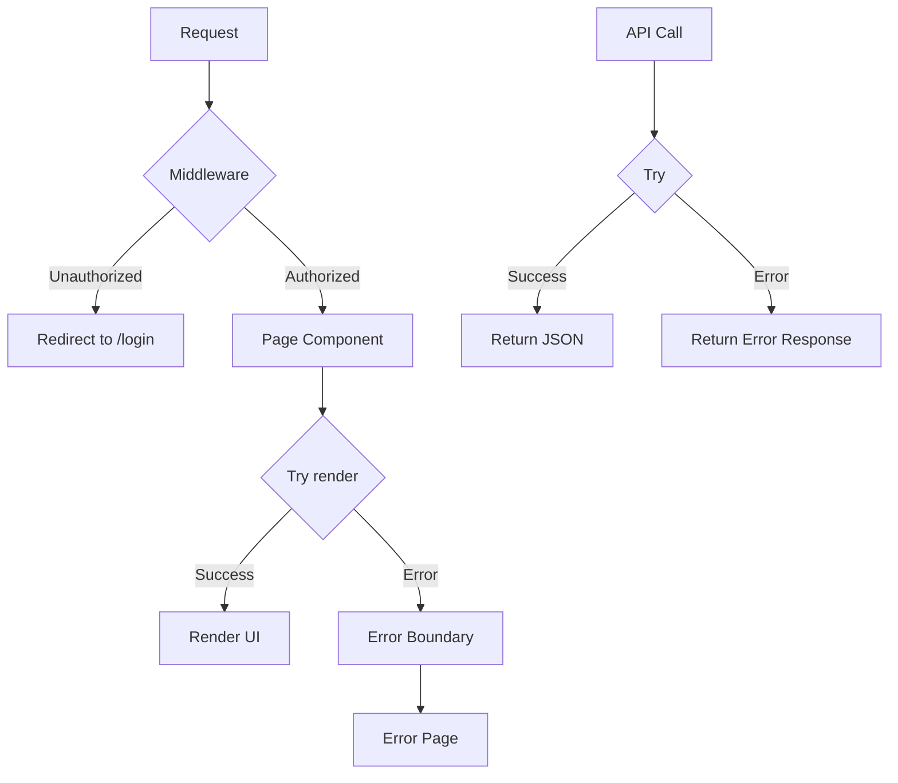

# Architecture Documentation

## Full System Architecture



## Component Overview

| Component | Technology | Purpose |
|-----------|------------|---------|
| **Data Platform** | Dagster + dbt + GX | ETL, transformations, data quality |
| **Web Application** | Next.js + Drizzle | User interface, API |
| **Database** | PostgreSQL | Shared data store |
| **Authentication** | NextAuth.js | Google OAuth |

For detailed data platform architecture, see [09-data-platform.md](./09-data-platform.md).

---

## Web Application Architecture

```mermaid
flowchart TB
    subgraph Client["Client Browser"]
        UI[React UI]
        RC[Recharts]
    end

    subgraph NextJS["Next.js Application"]
        subgraph Pages["App Router"]
            LP[Landing Page<br/>/]
            LG[Login Page<br/>/login]
            DB[Dashboard<br/>/dashboard]
            CP[Compare<br/>/dashboard/compare]
        end

        subgraph API["API Routes"]
            AR[/api/auth/*]
            ZR[/api/zhvi/*]
        end

        MW[Middleware]
        AUTH[NextAuth.js]
    end

    subgraph Database["Database Layer"]
        DZ[Drizzle ORM]
        PG[(PostgreSQL)]
    end

    subgraph External["External Services"]
        GO[Google OAuth]
    end

    UI --> Pages
    UI --> RC
    Pages --> API
    MW --> AUTH
    AUTH --> GO
    API --> DZ
    DZ --> PG
```

## Request Flow



## Component Architecture



## File Structure Details

```
src/
├── app/
│   ├── layout.tsx              # Root layout with Inter font
│   ├── page.tsx                # Landing page (server component)
│   ├── globals.css             # Tailwind CSS imports
│   ├── login/
│   │   └── page.tsx            # Login page (client component)
│   ├── dashboard/
│   │   ├── layout.tsx          # Dashboard layout with sidebar
│   │   ├── page.tsx            # Home values chart
│   │   └── compare/
│   │       └── page.tsx        # State comparison
│   └── api/
│       └── auth/
│           └── [...nextauth]/
│               └── route.ts    # NextAuth API handler
├── components/
│   └── ui/
│       ├── button.tsx          # Button with variants
│       └── card.tsx            # Card components
├── lib/
│   ├── utils.ts                # cn(), formatCurrency(), etc.
│   ├── auth/
│   │   ├── config.ts           # NextAuth configuration
│   │   └── index.ts            # Auth exports
│   └── db/
│       ├── schema.ts           # Drizzle schema
│       └── index.ts            # Database connection
└── middleware.ts               # Route protection
```

## State Management

The application uses minimal state management:



| State Type | Location | Purpose |
|------------|----------|---------|
| Authentication | NextAuth Session | User identity, tokens |
| Selected State | useState | Currently selected state for chart |
| Comparison List | useState | States being compared |
| Chart Data | Static/API | ZHVI time series data |

## Error Handling



## Security Considerations

1. **Authentication**: Google OAuth via NextAuth.js
2. **Session**: HTTP-only cookies, signed with NEXTAUTH_SECRET
3. **Route Protection**: Middleware checks session before allowing access
4. **Environment Variables**: Secrets stored in `.env.local` (not committed)
5. **CSRF**: Built-in NextAuth CSRF protection
