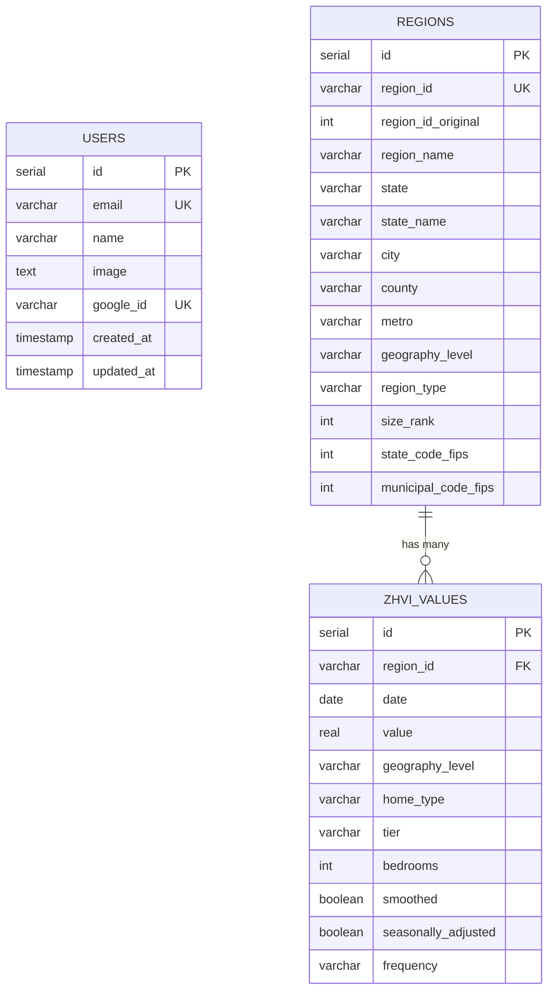

# Database Schema Documentation

## Overview

The database uses PostgreSQL with Drizzle ORM for type-safe queries. The schema is designed to efficiently store and query Zillow housing data.

## Entity Relationship Diagram



## Tables

### users

Stores authenticated users from Google OAuth.

| Column | Type | Constraints | Description |
|--------|------|-------------|-------------|
| id | serial | PRIMARY KEY | Auto-increment ID |
| email | varchar(255) | UNIQUE, NOT NULL | User email |
| name | varchar(255) | - | Display name |
| image | text | - | Profile picture URL |
| google_id | varchar(255) | UNIQUE | Google account ID |
| created_at | timestamp | NOT NULL, DEFAULT now() | Registration time |
| updated_at | timestamp | NOT NULL, DEFAULT now() | Last update time |

### regions

Dimension table containing geographic region metadata.

| Column | Type | Constraints | Description |
|--------|------|-------------|-------------|
| id | serial | PRIMARY KEY | Auto-increment ID |
| region_id | varchar(100) | UNIQUE, NOT NULL | Generated unique ID |
| region_id_original | integer | - | Original Zillow ID |
| region_name | varchar(255) | NOT NULL | Region display name |
| state | varchar(2) | - | State abbreviation |
| state_name | varchar(100) | - | Full state name |
| city | varchar(255) | - | City name |
| county | varchar(255) | - | County name |
| metro | varchar(255) | - | Metropolitan area |
| geography_level | varchar(50) | NOT NULL | State/County/Metro/City/Zip/Neighborhood |
| region_type | varchar(50) | - | Region classification |
| size_rank | integer | - | Population-based ranking |
| state_code_fips | integer | - | State FIPS code |
| municipal_code_fips | integer | - | Municipal FIPS code |

**Indexes:**
- `idx_regions_geography_level` - Filter by geography level
- `idx_regions_state` - Filter by state
- `idx_regions_region_id` - Lookup by region_id

### zhvi_values

Fact table containing Zillow Home Value Index time series data.

| Column | Type | Constraints | Description |
|--------|------|-------------|-------------|
| id | serial | PRIMARY KEY | Auto-increment ID |
| region_id | varchar(100) | NOT NULL | Foreign key to regions |
| date | date | NOT NULL | Observation date |
| value | real | - | ZHVI value in dollars |
| geography_level | varchar(50) | NOT NULL | State/County/Metro/City/Zip/Neighborhood |
| home_type | varchar(50) | NOT NULL | All Homes/Single Family/Condo |
| tier | varchar(50) | - | All/Bottom-Tier/Mid-Tier/Top-Tier |
| bedrooms | integer | - | Bedroom count (1-5) |
| smoothed | boolean | DEFAULT false | Is data smoothed |
| seasonally_adjusted | boolean | DEFAULT false | Is seasonally adjusted |
| frequency | varchar(20) | DEFAULT 'monthly' | monthly/weekly |

**Indexes:**
- `idx_zhvi_region_id` - Filter by region
- `idx_zhvi_date` - Filter by date
- `idx_zhvi_geography_level` - Filter by geography
- `idx_zhvi_region_date` - Composite for time series queries

## Data Volume Estimates

| Table | Rows (State-level) | Rows (Full) |
|-------|-------------------|-------------|
| users | ~100 | ~100 |
| regions | ~50 | 75,292 |
| zhvi_values | ~173,000 | 122,000,000+ |

## Drizzle Schema Code

```typescript
// src/lib/db/schema.ts

import {
  pgTable,
  serial,
  varchar,
  text,
  timestamp,
  integer,
  real,
  date,
  boolean,
  index,
} from 'drizzle-orm/pg-core';

export const users = pgTable('users', {
  id: serial('id').primaryKey(),
  email: varchar('email', { length: 255 }).notNull().unique(),
  name: varchar('name', { length: 255 }),
  image: text('image'),
  googleId: varchar('google_id', { length: 255 }).unique(),
  createdAt: timestamp('created_at').defaultNow().notNull(),
  updatedAt: timestamp('updated_at').defaultNow().notNull(),
});

export const regions = pgTable('regions', {
  id: serial('id').primaryKey(),
  regionId: varchar('region_id', { length: 100 }).notNull().unique(),
  regionIdOriginal: integer('region_id_original'),
  regionName: varchar('region_name', { length: 255 }).notNull(),
  state: varchar('state', { length: 2 }),
  stateName: varchar('state_name', { length: 100 }),
  city: varchar('city', { length: 255 }),
  county: varchar('county', { length: 255 }),
  metro: varchar('metro', { length: 255 }),
  geographyLevel: varchar('geography_level', { length: 50 }).notNull(),
  regionType: varchar('region_type', { length: 50 }),
  sizeRank: integer('size_rank'),
  stateCodeFips: integer('state_code_fips'),
  municipalCodeFips: integer('municipal_code_fips'),
}, (table) => [
  index('idx_regions_geography_level').on(table.geographyLevel),
  index('idx_regions_state').on(table.state),
  index('idx_regions_region_id').on(table.regionId),
]);

export const zhviValues = pgTable('zhvi_values', {
  id: serial('id').primaryKey(),
  regionId: varchar('region_id', { length: 100 }).notNull(),
  date: date('date').notNull(),
  value: real('value'),
  geographyLevel: varchar('geography_level', { length: 50 }).notNull(),
  homeType: varchar('home_type', { length: 50 }).notNull(),
  tier: varchar('tier', { length: 50 }),
  bedrooms: integer('bedrooms'),
  smoothed: boolean('smoothed').default(false),
  seasonallyAdjusted: boolean('seasonally_adjusted').default(false),
  frequency: varchar('frequency', { length: 20 }).default('monthly'),
}, (table) => [
  index('idx_zhvi_region_id').on(table.regionId),
  index('idx_zhvi_date').on(table.date),
  index('idx_zhvi_geography_level').on(table.geographyLevel),
  index('idx_zhvi_region_date').on(table.regionId, table.date),
]);
```

## Common Queries

### Get all states with latest ZHVI

```sql
SELECT DISTINCT r.state, r.state_name, z.value, z.date
FROM regions r
JOIN zhvi_values z ON r.region_id = z.region_id
WHERE r.geography_level = 'State'
  AND z.home_type = 'All Homes'
  AND z.date = (SELECT MAX(date) FROM zhvi_values)
ORDER BY z.value DESC;
```

### Get time series for a specific region

```sql
SELECT date, value
FROM zhvi_values
WHERE region_id = 'state_ca'
  AND home_type = 'All Homes'
ORDER BY date;
```

### Compare multiple states

```sql
SELECT r.state, z.date, z.value
FROM regions r
JOIN zhvi_values z ON r.region_id = z.region_id
WHERE r.state IN ('CA', 'TX', 'FL', 'NY')
  AND r.geography_level = 'State'
  AND z.home_type = 'All Homes'
ORDER BY z.date, r.state;
```
