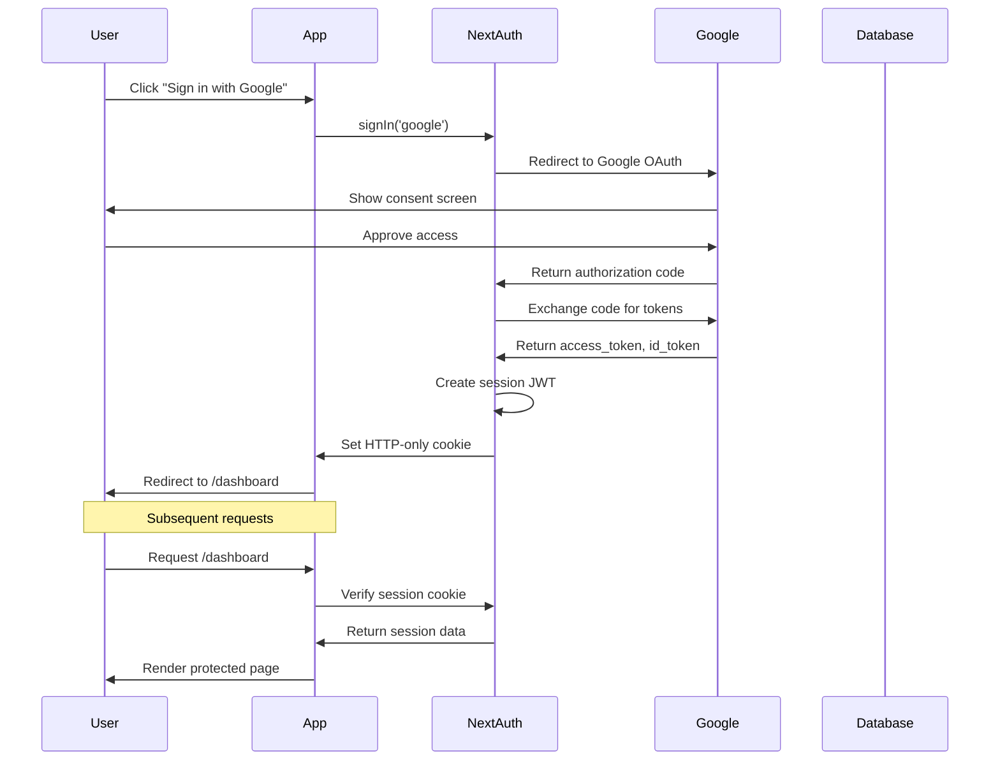
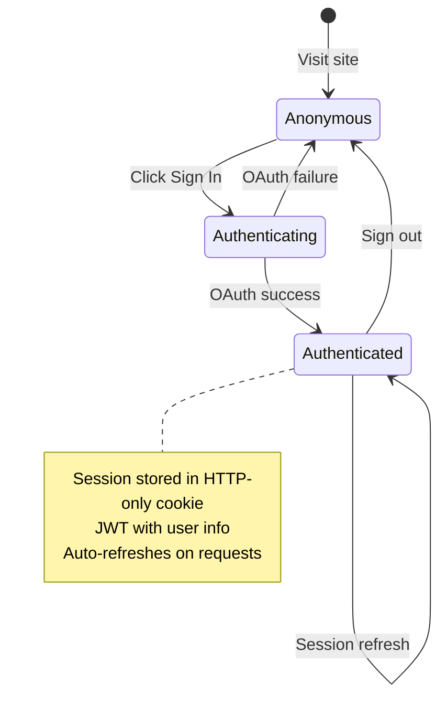
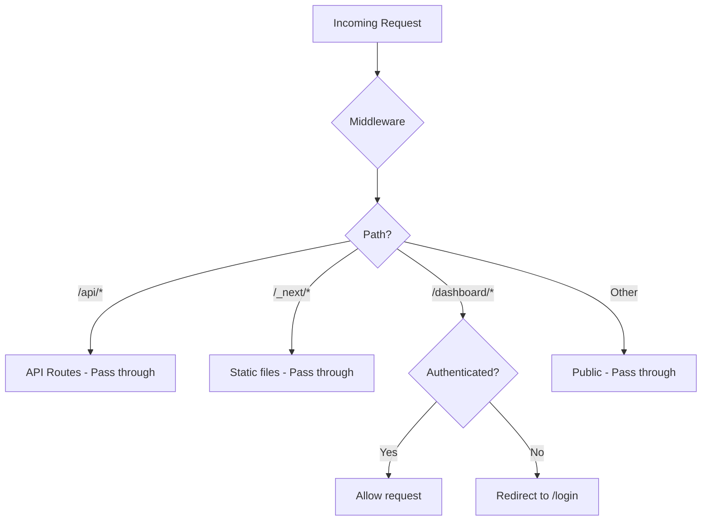
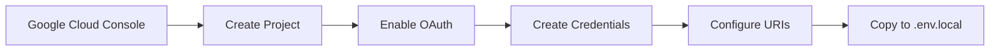

# Authentication Documentation

## Overview

HousingIQ uses NextAuth.js v5 (Auth.js) with Google OAuth for user authentication. The authentication flow is designed to be simple - no teams, no roles, just single-user access control.

## Authentication Flow



## Session Management



## Configuration Files

### NextAuth Configuration

**File:** `src/lib/auth/config.ts`

```typescript
import { NextAuthConfig } from 'next-auth';
import Google from 'next-auth/providers/google';

export const authConfig: NextAuthConfig = {
  providers: [
    Google({
      clientId: process.env.GOOGLE_CLIENT_ID!,
      clientSecret: process.env.GOOGLE_CLIENT_SECRET!,
    }),
  ],
  pages: {
    signIn: '/login',  // Custom login page
  },
  callbacks: {
    authorized({ auth, request: { nextUrl } }) {
      const isLoggedIn = !!auth?.user;
      const isOnDashboard = nextUrl.pathname.startsWith('/dashboard');

      if (isOnDashboard) {
        return isLoggedIn;  // Require auth for dashboard
      }
      return true;  // Allow all other routes
    },
    jwt({ token, user, account }) {
      if (user) token.id = user.id;
      if (account) token.accessToken = account.access_token;
      return token;
    },
    session({ session, token }) {
      if (session.user && token.id) {
        session.user.id = token.id as string;
      }
      return session;
    },
  },
};
```

### Auth Exports

**File:** `src/lib/auth/index.ts`

```typescript
import NextAuth from 'next-auth';
import { authConfig } from './config';

export const { handlers, auth, signIn, signOut } = NextAuth(authConfig);
```

### API Route Handler

**File:** `src/app/api/auth/[...nextauth]/route.ts`

```typescript
import { handlers } from '@/lib/auth';

export const { GET, POST } = handlers;
```

### Middleware

**File:** `src/middleware.ts`

```typescript
import { auth } from '@/lib/auth';

export default auth((req) => {
  const isLoggedIn = !!req.auth;
  const isOnDashboard = req.nextUrl.pathname.startsWith('/dashboard');

  if (isOnDashboard && !isLoggedIn) {
    return Response.redirect(new URL('/login', req.nextUrl));
  }
});

export const config = {
  matcher: ['/((?!api|_next/static|_next/image|favicon.ico).*)'],
};
```

## Route Protection



| Route | Protection | Description |
|-------|------------|-------------|
| `/` | Public | Landing page |
| `/login` | Public | Login page |
| `/dashboard` | Protected | Main dashboard |
| `/dashboard/*` | Protected | All dashboard routes |
| `/api/auth/*` | Public | NextAuth endpoints |

## Environment Variables

```bash
# .env.local

# NextAuth.js
NEXTAUTH_SECRET=your-secret-key-here
NEXTAUTH_URL=http://localhost:3000

# Google OAuth
GOOGLE_CLIENT_ID=your-client-id.apps.googleusercontent.com
GOOGLE_CLIENT_SECRET=GOCSPX-your-client-secret
```

## Setting Up Google OAuth

1. Go to [Google Cloud Console](https://console.cloud.google.com/)
2. Create a new project or select existing
3. Navigate to **APIs & Services > Credentials**
4. Click **Create Credentials > OAuth client ID**
5. Select **Web application**
6. Configure:
   - **Name:** HousingIQ
   - **Authorized JavaScript origins:** `http://localhost:3000`
   - **Authorized redirect URIs:** `http://localhost:3000/api/auth/callback/google`
7. Copy Client ID and Client Secret to `.env.local`



## Using Authentication in Components

### Server Components

```typescript
// Get session in server component
import { auth } from '@/lib/auth';

export default async function Page() {
  const session = await auth();

  if (!session) {
    return <p>Not authenticated</p>;
  }

  return <p>Welcome, {session.user?.name}</p>;
}
```

### Client Components

```typescript
'use client';

import { signIn, signOut } from 'next-auth/react';

export function LoginButton() {
  return (
    <button onClick={() => signIn('google', { callbackUrl: '/dashboard' })}>
      Sign in with Google
    </button>
  );
}

export function LogoutButton() {
  return (
    <button onClick={() => signOut({ callbackUrl: '/' })}>
      Sign out
    </button>
  );
}
```

### Server Actions

```typescript
// In dashboard layout
import { signOut } from '@/lib/auth';

<form action={async () => {
  'use server';
  await signOut({ redirectTo: '/' });
}}>
  <button type="submit">Sign Out</button>
</form>
```

## Session Data Structure

```typescript
interface Session {
  user: {
    id: string;
    name: string;
    email: string;
    image: string;
  };
  expires: string;  // ISO date string
}
```

## Security Features

| Feature | Implementation |
|---------|----------------|
| Session Storage | HTTP-only cookies (not accessible via JS) |
| Token Signing | HMAC-SHA256 with NEXTAUTH_SECRET |
| CSRF Protection | Built-in NextAuth CSRF tokens |
| Secure Cookies | `Secure` flag in production |
| SameSite | `Lax` policy |
