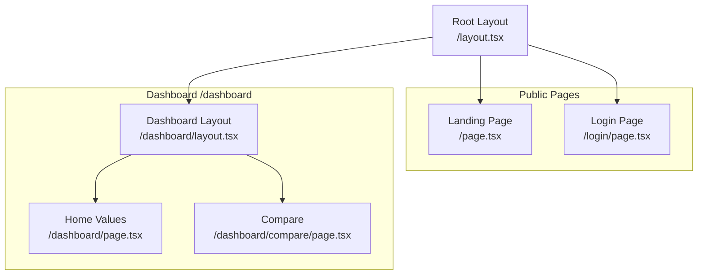
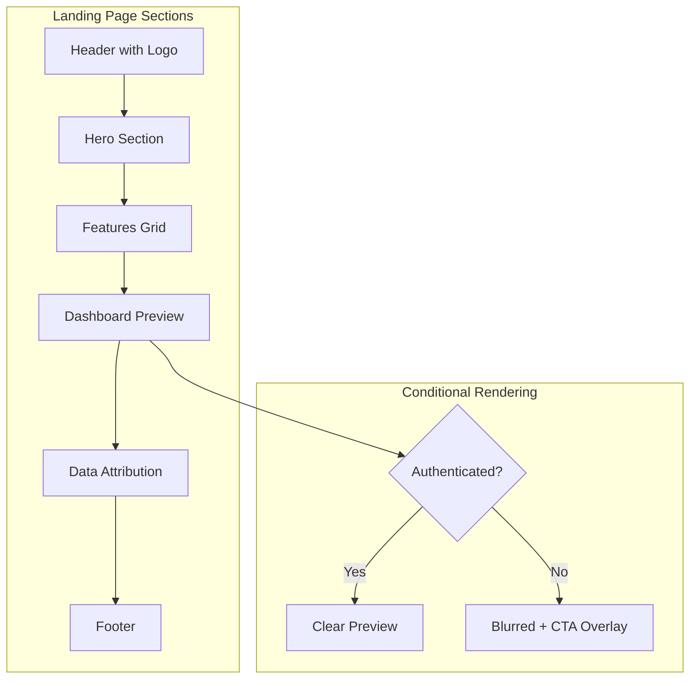
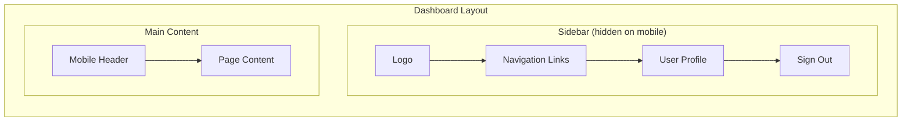
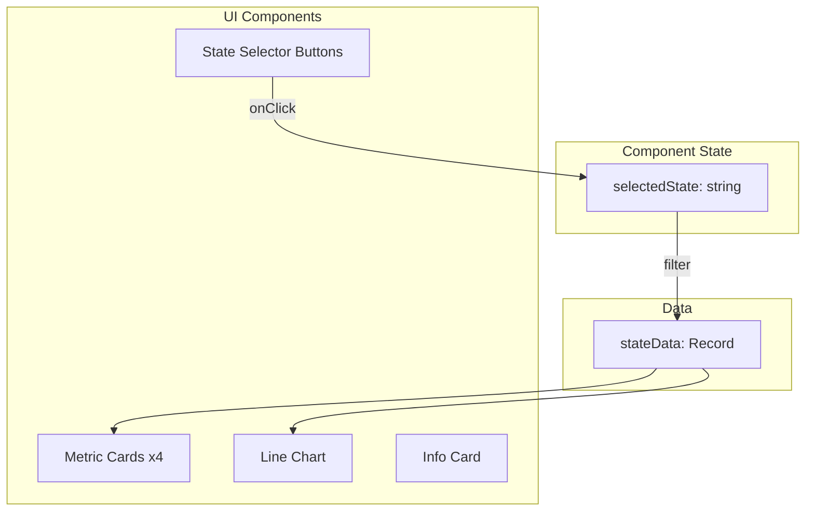

# Frontend Documentation

## Overview

The frontend is built with Next.js 16 using the App Router, React 19, TypeScript, and Tailwind CSS v4. Charts are rendered using Recharts.

## Page Structure



## Landing Page

**File:** `src/app/page.tsx`

The landing page is a server component that:
- Shows hero section with value proposition
- Displays feature cards
- Shows blurred dashboard preview for non-authenticated users
- Provides login CTA



### Key Features

| Section | Description |
|---------|-------------|
| Header | Logo + Sign In / Go to Dashboard button |
| Hero | Main headline, description, CTA buttons |
| Features | 3-column grid with icons |
| Preview | Mock dashboard with blur effect for guests |
| Attribution | Zillow data source credit |

## Login Page

**File:** `src/app/login/page.tsx`

Client component with Google OAuth button.

```typescript
'use client';

import { signIn } from 'next-auth/react';

export default function LoginPage() {
  const handleGoogleSignIn = () => {
    signIn('google', { callbackUrl: '/dashboard' });
  };

  return (
    <Button onClick={handleGoogleSignIn}>
      Continue with Google
    </Button>
  );
}
```

## Dashboard Layout

**File:** `src/app/dashboard/layout.tsx`

Server component providing:
- Sidebar navigation
- User profile display
- Sign out functionality
- Responsive design (hidden sidebar on mobile)



### Navigation Items

| Icon | Label | Route |
|------|-------|-------|
| TrendingUp | Home Values | /dashboard |
| BarChart3 | Compare Regions | /dashboard/compare |

## Dashboard Home Page

**File:** `src/app/dashboard/page.tsx`

Client component with interactive ZHVI chart.



### Metrics Displayed

| Metric | Description |
|--------|-------------|
| Current Median Value | Latest ZHVI for selected state |
| Year-over-Year Change | % change vs 12 months ago |
| 5-Year Change | % change vs 60 months ago |
| Data Range | Number of months available |

### Chart Configuration

```typescript
<LineChart data={data}>
  <CartesianGrid strokeDasharray="3 3" />
  <XAxis dataKey="formattedDate" />
  <YAxis tickFormatter={(v) => `$${(v/1000).toFixed(0)}k`} />
  <Tooltip formatter={(v) => formatCurrency(v)} />
  <Legend />
  <Line
    type="monotone"
    dataKey="value"
    stroke="#2563eb"
    strokeWidth={2}
    dot={false}
  />
</LineChart>
```

## Compare Page

**File:** `src/app/dashboard/compare/page.tsx`

Multi-state comparison with overlaid charts.

```mermaid
flowchart TD
    subgraph State["Component State"]
        SEL[selectedStates: string[]]
    end

    subgraph Logic["Logic"]
        ADD[addState]
        REM[removeState]
        CREATE[createChartData]
    end

    subgraph UI["UI"]
        PICKER[State Picker Buttons]
        CARDS[Comparison Cards]
        CHART[Multi-line Chart]
    end

    SEL --> CREATE --> CHART
    SEL --> CARDS
    PICKER --> ADD --> SEL
    PICKER --> REM --> SEL
```

### Features

- Select up to 4 states to compare
- Each state has a unique color
- Side-by-side metric cards
- Overlaid line chart with legend

## UI Components

### Button Component

**File:** `src/components/ui/button.tsx`

Uses `class-variance-authority` for variants:

| Variant | Style |
|---------|-------|
| default | Dark background, light text |
| destructive | Red background |
| outline | Border only |
| secondary | Gray background |
| ghost | Transparent, hover effect |
| link | Underline on hover |

| Size | Dimensions |
|------|------------|
| default | h-9, px-4 |
| sm | h-8, px-3, text-xs |
| lg | h-10, px-8 |
| icon | h-9, w-9 |

### Card Component

**File:** `src/components/ui/card.tsx`

Compound component pattern:

```typescript
<Card>
  <CardHeader>
    <CardTitle>Title</CardTitle>
    <CardDescription>Description</CardDescription>
  </CardHeader>
  <CardContent>
    Content here
  </CardContent>
  <CardFooter>
    Footer actions
  </CardFooter>
</Card>
```

## Styling

### Tailwind CSS v4

**File:** `src/app/globals.css`

```css
@import "tailwindcss";

@theme {
  --font-sans: var(--font-inter), ui-sans-serif, system-ui, sans-serif;
  --container-center: true;
  --container-padding: 1rem;
}

/* Container breakpoints */
.container {
  width: 100%;
  margin: 0 auto;
  padding: 0 1rem;
}

@media (min-width: 1280px) {
  .container { max-width: 1280px; }
}
```

### Utility Functions

**File:** `src/lib/utils.ts`

```typescript
// Merge Tailwind classes safely
export function cn(...inputs: ClassValue[]) {
  return twMerge(clsx(inputs));
}

// Format currency
export function formatCurrency(value: number): string {
  return new Intl.NumberFormat('en-US', {
    style: 'currency',
    currency: 'USD',
    minimumFractionDigits: 0,
  }).format(value);
}

// Format percentage
export function formatPercent(value: number): string {
  return new Intl.NumberFormat('en-US', {
    style: 'percent',
    minimumFractionDigits: 1,
  }).format(value / 100);
}
```

## Hydration Safety

To prevent SSR/client hydration mismatches, avoid:

- `Math.random()` - Use seeded random instead
- `Date.now()` - Use static timestamps
- `toLocaleDateString()` - Use explicit formatting

```typescript
// Bad - different on server vs client
const random = Math.random();
const date = new Date().toLocaleDateString();

// Good - deterministic
function seededRandom(seed: number) {
  const x = Math.sin(seed) * 10000;
  return x - Math.floor(x);
}

const monthNames = ['Jan', 'Feb', ...];
const formatted = `${monthNames[month - 1]} ${year}`;
```

## Icons

Using Lucide React for consistent iconography:

```typescript
import {
  Home,
  TrendingUp,
  TrendingDown,
  BarChart3,
  MapPin,
  Calendar,
  ArrowRight,
  LogOut,
  X,
} from 'lucide-react';
```
