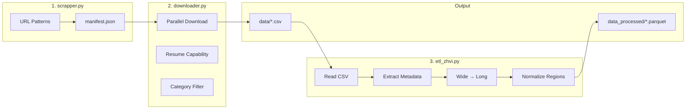

# Zillow Data Source

## Overview

The Zillow data source is a complete ETL pipeline for scraping, downloading, and processing Zillow Research data. This is the primary data source for HousingIQ.

**Location:** Currently at `zillow_data_sc/` (to be migrated into `data-platform/ingestion/sources/zillow/`)

## Data Categories

| Category | Description | Update Frequency |
|----------|-------------|------------------|
| **zhvi** | Zillow Home Value Index | Monthly |
| **zori** | Zillow Observed Rent Index | Monthly |
| **zordi** | Zillow Observed Renter Demand Index | Monthly |
| **zhvf_growth** | Home Value Forecasts | Monthly |
| **zorf_growth** | Rental Forecasts | Monthly |
| **invt_fs** | For-Sale Inventory | Weekly/Monthly |
| **new_listings** | New Listings Count | Weekly/Monthly |
| **sales_count_now** | Sales Count (Nowcast) | Monthly |
| **market_temp_index** | Market Heat Index | Monthly |
| **mortgage_payment** | Mortgage Payment Estimates | Monthly |
| **new_homeowner_income_needed** | Income Required (Homeowner) | Monthly |
| **new_renter_income_needed** | Income Required (Renter) | Monthly |

## Pipeline Architecture



## Current Directory Structure

```
zillow_data_sc/
├── scrapper.py              # Generate all possible download URLs
├── downloader.py            # Parallel CSV downloader with resume
├── etl_zhvi.py              # ETL: wide → long format transformation
├── manifest.json            # Auto-generated URL catalog (150+ files)
├── download_log.json        # Download statistics
│
├── data/                    # Downloaded CSV files (by category)
│   ├── zhvi/                # Home value index files
│   │   ├── Metro_zhvi_uc_sfrcondo_tier_0.33_0.67_sm_sa_month.csv
│   │   ├── State_zhvi_uc_sfrcondo_tier_0.33_0.67_sm_sa_month.csv
│   │   └── ...
│   ├── zori/                # Rent index files
│   └── invt_fs/             # Inventory files
│
└── data_processed/          # Processed Parquet files
    ├── regions.parquet      # Dimension table (75K+ regions)
    ├── zhvi_values.parquet  # Fact table (millions of rows)
    └── by_geography/        # Split by geography level
        ├── zhvi_metro.parquet
        ├── zhvi_state.parquet
        ├── zhvi_county.parquet
        ├── zhvi_city.parquet
        └── zhvi_zip.parquet
```

## Components

### 1. scrapper.py - URL Generator

Generates all possible download URLs from Zillow Research based on known URL patterns.

**Features:**
- Covers 35+ data patterns across 13 categories
- Supports all geography levels (Metro, State, County, City, Zip, Neighborhood)
- Generates manifest for incremental updates
- Detects new/updated datasets

**Usage:**

```bash
python scrapper.py
```

**Output:** `manifest.json` with ~150+ download URLs

```json
{
  "total_links": 156,
  "total_categories": 13,
  "categories": ["zhvi", "zori", "invt_fs", ...],
  "all_links": [
    {
      "url": "https://files.zillowstatic.com/research/public_csvs/zhvi/Metro_zhvi_uc_sfrcondo_tier_0.33_0.67_sm_sa_month.csv",
      "category": "zhvi",
      "filename": "Metro_zhvi_uc_sfrcondo_tier_0.33_0.67_sm_sa_month.csv",
      "geography": "Metro",
      "description": "ZHVI All Homes (SFR, Condo/Co-op) Smoothed, Seasonally Adjusted (Metro level)"
    }
  ]
}
```

### 2. downloader.py - Parallel Downloader

Downloads CSV files with parallel execution and resume capability.

**Features:**
- Parallel downloads (configurable workers)
- Skip existing files (resume interrupted downloads)
- Category filtering (download only what you need)
- Progress tracking with tqdm
- Rate limiting to avoid blocks
- Detailed logging with statistics

**Usage:**

```bash
# Download specific categories (edit CATEGORIES_TO_DOWNLOAD in file)
python downloader.py

# Force re-download
python downloader.py --force

# List available categories
python downloader.py --list
```

**Configuration:**

```python
# In downloader.py
CATEGORIES_TO_DOWNLOAD = ['zhvi', 'zori']  # Or None for all
```

**Output:**

```
📋 Loaded manifest: 156 links across 13 categories
📦 Available categories: zhvi, zori, invt_fs, ...
✅ Selected categories: zhvi, zori
📥 Filtered to 84 files

Downloading CSV: 100%|████████████| 84/84 [01:23<00:00]

📊 DOWNLOAD SUMMARY
Total Files:    84
✅ Success:     72
⏭️  Skipped:    12
❌ Failed:      0
```

### 3. etl_zhvi.py - ETL Pipeline

Transforms Zillow CSV data from wide format to long format using Polars.

**Features:**
- High-performance processing with Polars (20-50x faster than pandas)
- Schema normalization across different files
- Region extraction to separate dimension table
- Metadata extraction from filenames
- Geography-based partitioning
- Parquet output with Snappy compression

**Input Format (Wide):**

```
RegionID | RegionName | State | 2023-01 | 2023-02 | 2023-03 | ...
12345    | Austin     | TX    | 450000  | 455000  | 460000  | ...
```

**Output Format (Long):**

```
region_id | date       | value  | geography_level | home_type | tier     | ...
12345     | 2023-01-01 | 450000 | Metro           | All Homes | Mid-Tier | ...
12345     | 2023-02-01 | 455000 | Metro           | All Homes | Mid-Tier | ...
```

**Usage:**

```bash
python etl_zhvi.py
```

**Extracted Metadata:**

| Field | Values |
|-------|--------|
| `geography_level` | Metro, State, County, City, Zip, Neighborhood |
| `home_type` | All Homes, Single Family, Condo |
| `tier` | All, Bottom-Tier, Mid-Tier, Top-Tier |
| `bedrooms` | 1, 2, 3, 4, 5+ (if applicable) |
| `smoothed` | True/False |
| `seasonally_adjusted` | True/False |
| `frequency` | monthly, weekly |

## Data Schema

### Regions Table (Dimension)

| Column | Type | Description |
|--------|------|-------------|
| `region_id` | String | Unique region identifier |
| `region_id_original` | Integer | Original Zillow RegionID |
| `region_name` | String | Region name |
| `state` | String | State abbreviation (2 chars) |
| `state_name` | String | Full state name |
| `city` | String | City name |
| `metro` | String | Metro area |
| `county` | String | County name |
| `GeographyLevel` | String | Geography level |

### Values Table (Fact)

| Column | Type | Description |
|--------|------|-------------|
| `region_id` | String | Foreign key to regions |
| `date` | Date | Observation date |
| `value` | Float | ZHVI value (home price in USD) |
| `geography_level` | String | Geography level |
| `home_type` | String | Home type |
| `tier` | String | Price tier |
| `bedrooms` | Integer | Bedroom count (nullable) |
| `smoothed` | Boolean | Smoothed indicator |
| `seasonally_adjusted` | Boolean | SA indicator |
| `frequency` | String | Data frequency |

## Quick Start

```bash
cd zillow_data_sc

# 1. Generate URL manifest
python scrapper.py

# 2. Download data (edit CATEGORIES_TO_DOWNLOAD first)
python downloader.py

# 3. Run ETL pipeline
python etl_zhvi.py
```

## Migration to Data Platform

The `zillow_data_sc` code will be migrated into the data platform as Dagster assets:

### Target Structure

```
data-platform/
├── ingestion/
│   └── sources/
│       └── zillow/
│           ├── __init__.py
│           ├── scraper.py       # From scrapper.py
│           ├── downloader.py    # From downloader.py
│           └── config.py        # URL patterns, categories
│
├── dagster/
│   └── assets/
│       └── zillow.py            # Dagster asset definitions
│
└── data/
    └── raw/
        └── zillow/              # Downloaded CSVs
```

### Dagster Asset Integration

```python
# data-platform/dagster/assets/zillow.py
from dagster import asset, MaterializeResult, AssetExecutionContext

@asset(group_name="ingestion", kinds={"python", "zillow"})
def zillow_manifest(context: AssetExecutionContext) -> MaterializeResult:
    """Generate Zillow URL manifest."""
    from ingestion.sources.zillow.scraper import ZillowCompleteScraper

    scraper = ZillowCompleteScraper()
    links = scraper.generate_all_urls()
    scraper.save_links_manifest(links, "data/raw/zillow/manifest.json")

    return MaterializeResult(
        metadata={"total_links": len(links)}
    )


@asset(
    group_name="ingestion",
    kinds={"python", "zillow"},
    deps=["zillow_manifest"]
)
def raw_zillow_zhvi(context: AssetExecutionContext) -> MaterializeResult:
    """Download Zillow ZHVI data."""
    from ingestion.sources.zillow.downloader import ZillowDownloader

    downloader = ZillowDownloader(output_dir="data/raw/zillow")
    stats = downloader.download_from_manifest(
        manifest_path="data/raw/zillow/manifest.json",
        categories=["zhvi"],
        skip_existing=True
    )

    return MaterializeResult(
        metadata={
            "files_downloaded": stats["success"],
            "files_skipped": stats["skipped"],
        }
    )
```

### dbt Source Configuration

After migration, dbt sources will read from the raw tables:

```yaml
# data-platform/dbt/models/staging/_sources.yml
sources:
  - name: zillow
    schema: raw
    description: "Raw Zillow data loaded by Python ingestion"
    tables:
      - name: raw_regions
        description: "Region dimension from Zillow"
      - name: raw_zhvi
        description: "ZHVI values in long format"
```

## Performance

| Operation | Time | Notes |
|-----------|------|-------|
| URL Generation | ~1 sec | 150+ URLs |
| Download (5 workers) | ~2-5 min | Depends on network |
| ETL Processing | ~30-60 sec | 50+ files, millions of rows |

### Why Polars?

- 20-50x faster than pandas for large datasets
- Lazy evaluation for memory efficiency
- Native parallel processing
- Zero-copy operations

## Data Volume

| Geography Level | Approximate Records |
|-----------------|---------------------|
| State | ~50 |
| Metro | ~900 |
| County | ~3,000 |
| City | ~30,000 |
| Zip | ~25,000 |

With monthly data from 2000-present, total records can exceed **100 million rows**.

## Notes

- Zillow Research Data is updated monthly
- Some geography/indicator combinations may not exist (404 errors are expected)
- Large files (Zip-level) may take longer to process
- Parquet format provides ~5-10x compression vs CSV

## License

Zillow data is subject to [Zillow's Terms of Use](https://www.zillow.com/z/corp/terms/). This project is for educational purposes.
