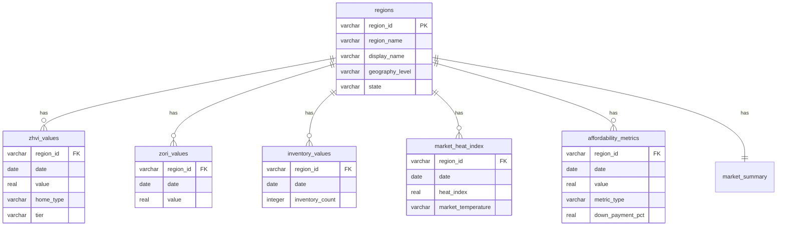

git# HousingIQ Data Architecture

## Overview

This document maps the complete data flow from raw Zillow data files through transformation, database storage, and finally to webapp features.

---

## Data Pipeline Flow

```
Raw CSV Files → Dagster Transform → Parquet Files → Dagster DB Load → PostgreSQL → API Routes → Webapp Pages
```

---

## Complete Data Mapping

### 1. Home Values (ZHVI)

| Stage | Location | Details |
|-------|----------|---------|
| **Raw Data** | `data/zhvi/*.csv` | Wide format: RegionID, date columns |
| **Transform Asset** | `fct_zhvi_values` | Unpivot, add YoY/MoM metrics |
| **Parquet** | `data/processed/fct_zhvi_values.parquet` | 1.8GB, all home types/tiers/bedrooms |
| **DB Load Asset** | `app_zhvi_values` | Load to PostgreSQL |
| **DB Table** | `app.zhvi_values` | region_id, date, value, home_type, tier, bedrooms |
| **API Routes** | `/api/market/[regionId]`, `/api/market/rankings` | Compare, analyze |
| **Webapp Pages** | `/dashboard`, `/dashboard/compare`, `/dashboard/rankings` | Price trends, comparisons |

---

### 2. Rental Values (ZORI)

| Stage | Location | Details |
|-------|----------|---------|
| **Raw Data** | `data/zori/*.csv` | Rent values by region |
| **Transform Asset** | `fct_zori_values` | Unpivot, YoY/MoM |
| **Parquet** | `data/processed/fct_zori_values.parquet` | 64MB |
| **DB Load Asset** | `app_zori_values` | Load to PostgreSQL |
| **DB Table** | `app.zori_values` | region_id, date, value |
| **API Routes** | `/api/market/[regionId]` | Rent data |
| **Webapp Pages** | `/dashboard` | Rent trends, P/R ratio |

---

### 3. For-Sale Inventory

| Stage | Location | Details |
|-------|----------|---------|
| **Raw Data** | `data/invt_fs/*.csv` | Inventory counts |
| **Transform Asset** | `fct_inventory_values` | Unpivot, YoY/MoM |
| **Parquet** | `data/processed/fct_inventory_values.parquet` | 1MB |
| **DB Load Asset** | `app_inventory_values` | Load to PostgreSQL |
| **DB Table** | `app.inventory_values` | region_id, date, inventory_count |
| **API Routes** | `/api/market/inventory` | Inventory data |
| **Webapp Pages** | `/dashboard/inventory` | Supply-demand, heat map |

---

### 4. Market Heat Index 🆕

| Stage | Location | Details |
|-------|----------|---------|
| **Raw Data** | `data/market_temp_index/*.csv` | Heat index 0-100 |
| **Transform Asset** | `fct_market_heat_index` | YoY/MoM, temperature classification |
| **Parquet** | `data/processed/fct_market_heat_index.parquet` | 365KB, 85K rows |
| **DB Load Asset** | `app_market_heat_index` | Load to PostgreSQL |
| **DB Table** | `app.market_heat_index` | region_id, date, heat_index, market_temperature |
| **API Routes** | `/api/market/heat` | Heat data, hottest/coolest |
| **Webapp Pages** | `/dashboard/market-pulse` | Temperature gauge, rankings |

---

### 5. Affordability Metrics 🆕

| Stage | Location | Details |
|-------|----------|---------|
| **Raw Data** | `data/mortgage_payment/*.csv`, `data/total_monthly_payment/*.csv`, `data/new_homeowner_income_needed/*.csv`, `data/new_renter_income_needed/*.csv` | Payment & income data |
| **Transform Asset** | `fct_affordability_metrics` | Combine all, add down_payment_pct |
| **Parquet** | `data/processed/fct_affordability_metrics.parquet` | 37MB, 3.3M rows |
| **DB Load Asset** | `app_affordability_metrics` | Load to PostgreSQL |
| **DB Table** | `app.affordability_metrics` | region_id, date, value, metric_type, down_payment_pct |
| **API Routes** | `/api/market/affordability` | Payment scenarios |
| **Webapp Pages** | `/dashboard/affordability` | Calculator, rent vs buy |

---

### 6. Regions Dimension

| Stage | Location | Details |
|-------|----------|---------|
| **Source** | Extracted from all data files | RegionID, RegionName, State |
| **Transform Asset** | `dim_regions` | Dedupe, add display names |
| **Parquet** | `data/processed/dim_regions.parquet` | 530KB |
| **DB Load Asset** | `app_regions` | Load to PostgreSQL |
| **DB Table** | `app.regions` | region_id, region_name, display_name, geography_level, state |
| **API Routes** | `/api/regions`, all market APIs | Region lookup |
| **Webapp Pages** | All dashboards | Region search/select |

---

### 7. Market Summary (Pre-computed)

| Stage | Location | Details |
|-------|----------|---------|
| **Source** | Joins dim_regions + fct_zhvi + fct_zori | Aggregated metrics |
| **Transform Asset** | `market_summary` | Latest values, YoY, P/R ratio |
| **Parquet** | `data/processed/market_summary.parquet` | 794KB |
| **DB Load Asset** | `app_market_summary` | Load to PostgreSQL |
| **DB Table** | `app.market_summary` | All pre-computed metrics |
| **API Routes** | `/api/market/rankings`, `/api/market/all` | Quick queries |
| **Webapp Pages** | `/dashboard/rankings`, home page | Rankings, overview |

---

## Database Schema Diagram



---

## Dagster Asset Dependency Graph

```
zillow_raw_files
     │
     ├── fct_zhvi_values ──────► app_zhvi_values
     ├── fct_zori_values ──────► app_zori_values
     ├── fct_inventory_values ─► app_inventory_values
     ├── fct_market_heat_index ► app_market_heat_index
     ├── fct_affordability_metrics ► app_affordability_metrics
     └── dim_regions ──────────► app_regions
                                      │
                                      ▼
                              market_summary
                                      │
                                      ▼
                          app_market_summary
```

---

## Feature → Data Source Mapping

| Feature | Page | API Route | DB Tables |
|---------|------|-----------|-----------|
| Price Trends | `/dashboard` | `/api/market/[regionId]` | zhvi_values, regions |
| Rent Trends | `/dashboard` | `/api/market/[regionId]` | zori_values, regions |
| Compare Markets | `/dashboard/compare` | `/api/market/compare` | zhvi_values, zori_values |
| Rankings | `/dashboard/rankings` | `/api/market/rankings` | market_summary |
| Inventory | `/dashboard/inventory` | `/api/market/inventory` | inventory_values |
| Market Pulse | `/dashboard/market-pulse` | `/api/market/heat` | market_heat_index |
| Affordability | `/dashboard/affordability` | `/api/market/affordability` | affordability_metrics |
