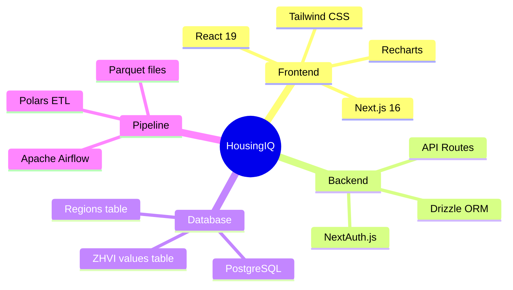

# HousingIQ Documentation

## Table of Contents

| Document | Description |
|----------|-------------|
| [01-overview.md](./01-overview.md) | Project introduction and high-level architecture |
| [02-architecture.md](./02-architecture.md) | Detailed system architecture and component design |
| [03-database-schema.md](./03-database-schema.md) | Database tables, relationships, and queries |
| [04-authentication.md](./04-authentication.md) | Google OAuth and NextAuth.js configuration |
| [05-frontend.md](./05-frontend.md) | React components, pages, and styling |
| [06-data-pipeline.md](./06-data-pipeline.md) | Airflow DAGs and ETL processes |
| [07-setup-guide.md](./07-setup-guide.md) | Step-by-step installation instructions |
| [08-api-reference.md](./08-api-reference.md) | API endpoints and data types |

## Quick Links

### Getting Started
- [Setup Guide](./07-setup-guide.md) - Start here for installation

### Architecture
- [System Overview](./01-overview.md#high-level-architecture)
- [Component Architecture](./02-architecture.md#component-architecture)
- [Database ERD](./03-database-schema.md#entity-relationship-diagram)

### Development
- [Frontend Components](./05-frontend.md)
- [Authentication Flow](./04-authentication.md#authentication-flow)
- [API Reference](./08-api-reference.md)

### Data Pipeline
- [Pipeline Architecture](./06-data-pipeline.md#pipeline-architecture)
- [Running Airflow](./06-data-pipeline.md#running-the-pipeline)

## Project Summary



## What Was Built

### Phase 1: Project Setup
- [x] Created `housingiq-app/` folder structure
- [x] Initialized Next.js 16 with TypeScript
- [x] Configured Tailwind CSS v4
- [x] Set up Docker Compose for PostgreSQL (port 5432)

### Phase 2: Database
- [x] Designed Drizzle ORM schema
- [x] Created users, regions, zhvi_values tables
- [x] Added indexes for performance
- [x] Configured environment variables

### Phase 3: Authentication
- [x] Integrated NextAuth.js v5
- [x] Configured Google OAuth provider
- [x] Created login page with Google button
- [x] Implemented route protection middleware

### Phase 4: Frontend
- [x] Built landing page with feature preview
- [x] Created dashboard layout with sidebar
- [x] Implemented ZHVI chart with Recharts
- [x] Added state comparison page
- [x] Fixed hydration issues (seeded random)

### Phase 5: Data Pipeline
- [x] Set up Airflow with Docker Compose
- [x] Created ETL scripts with Polars
- [x] Defined DAG for data loading
- [x] Connected to webapp database

## Tech Stack Summary

| Category | Technology |
|----------|------------|
| **Frontend** | Next.js 16, React 19, TypeScript |
| **Styling** | Tailwind CSS v4, shadcn/ui |
| **Charts** | Recharts |
| **Database** | PostgreSQL 16, Drizzle ORM |
| **Auth** | NextAuth.js v5, Google OAuth |
| **Pipeline** | Apache Airflow 2.8, Polars |
| **Container** | Docker, Docker Compose |

## File Structure

```
housingiq-app/
├── webapp/
│   ├── src/
│   │   ├── app/
│   │   │   ├── page.tsx          # Landing
│   │   │   ├── login/            # Login
│   │   │   ├── dashboard/        # Dashboard
│   │   │   └── api/auth/         # Auth API
│   │   ├── components/ui/        # UI components
│   │   ├── lib/
│   │   │   ├── db/               # Database
│   │   │   └── auth/             # Auth config
│   │   └── middleware.ts         # Route protection
│   ├── docker-compose.yml        # Postgres
│   └── drizzle.config.ts         # ORM config
├── data-pipeline/
│   ├── dags/                     # Airflow DAGs
│   ├── scripts/                  # ETL scripts
│   └── docker-compose.yml        # Airflow
├── docs/                         # Documentation
└── README.md
```

## Next Steps

1. **Load Real Data**
   - Start Airflow
   - Trigger the `load_zillow_data` DAG
   - Connect dashboard to database API

2. **Expand Features**
   - Add metro/city/zip drill-down
   - Implement rental data (ZORI)
   - Add market forecasts

3. **Production Deployment**
   - Configure Neon Postgres
   - Deploy to Vercel
   - Set up production OAuth
